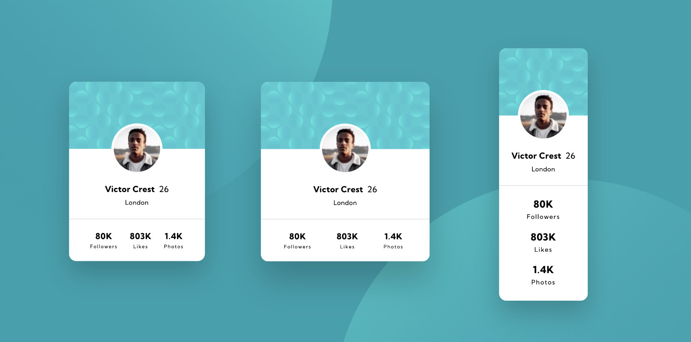

# Frontend Mentor - Profile card component solution

This is a solution to the [Profile card component challenge on Frontend Mentor](https://www.frontendmentor.io/challenges/profile-card-component-cfArpWshJ). Frontend Mentor challenges help you improve your coding skills by building realistic projects. 

## Table of contents

- [Frontend Mentor - Profile card component solution](#frontend-mentor---profile-card-component-solution)
  - [Table of contents](#table-of-contents)
  - [Overview](#overview)
    - [The challenge](#the-challenge)
    - [Screenshots](#screenshots)
    - [Links](#links)
  - [My process](#my-process)
    - [Built with](#built-with)
    - [What I learned](#what-i-learned)
    - [Continued development](#continued-development)
    - [Useful resources](#useful-resources)
  - [Author](#author)

## Overview

### The challenge

- Build out the project to the designs provided

### Screenshots

Desktop & Mobile



### Links

- [Solution code on Github](https://github.com/mindful108/frontendmentor-profile-card-component.git)
- [Live solution](https://frontendmentor-profile-card-component-orcin.vercel.app)

## My process

### Built with

- Semantic HTML5 markup
- CSS with custom variables
- Flexbox
- Mobile-first workflow

### What I learned

I spent most of my time tweaking the background images and the spacing for the stat section at the bottom.

The background image position is dependent on the dimensions of the screen which will always be unique, so it was tricky to deconstruct without the design files. Placing one image top/left and the other bottom/right gives a different result than the design and so I settled on placing them with pixel locations at 1440 x 720 just for the challenge screenshot. 

For the stats section at the bottom, I used flexbox, content justified using ```space-between``` and then added padding for the outer spacing. It looks like the designer may have altered the spacing visually (which a designer should do!) rather than just going by the numbers. Using flexbox however will account for inevitable variation in content length.

``` css
.profile-stats {
  border-top: 1px solid #d9d9d9;
  letter-spacing: 1px;
  margin-top: 24px;
  display: flex;
  justify-content: space-between;
  padding: 1.4rem 2.75rem;
}
```

### Continued development

I plan to do more Frontend Mentor projects to continue developing my speed and workflow using my own custom snippets and starter templates. I will also start to use Tailwind CSS and looking forward to incorporating React for more interactive challenges.

### Useful resources

I used this [MDN doc on CSS background images](https://developer.mozilla.org/en-US/docs/Web/CSS/background) for reference. 

 
## Author

- Website - [Judah Lynn](https://judahlynn.com)
- Frontend Mentor - [@mindful108](https://www.frontendmentor.io/profile/mindful108)